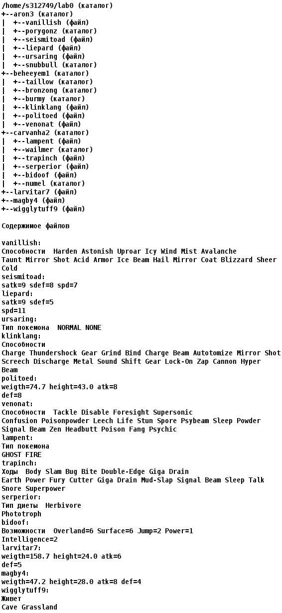

# Текст задания к 0-й лабораторной работе по предмету Основы Профессиональной Деятельности
## Вариант:32749
### 1. Создать приведенное в варианте дерево каталогов и файлов с содержимым. В качестве корня дерева использовать каталог lab0 своего домашнего каталога. \
Для создания и навигации по дереву использовать команды: *mkdir*, *echo*, *cat*, *touch*, *ls*, *pwd*, *cd*, *more*, *cp*, *rm*, *rmdir*, *mv*:

### 2. Установить согласно заданию права на файлы и каталоги при помощи команды *chmod*, используя различные способы указания прав:

* aron3: права 330
* vanillish: владелец должен не иметь никаких прав; группа-владелец должна читать и записывать файл; остальные пользователи должны не иметь никаких прав
* porygonz: владелец должен записывать директорию и переходить в нее; группа-владелец должна записывать директорию и переходить в нее; остальные пользователи должны записывать директорию и переходить в нее
* seismitoad: владелец должен читать и записывать файл; группа-владелец должна не иметь никаких прав; остальные пользователи должны читать файл
* liepard: владелец должен читать файл; группа-владелец должна читать файл; остальные пользователи должны читать файл
* ursaring: владелец должен читать и записывать файл; группа-владелец должна читать файл; остальные пользователи должны не иметь никаких прав
* snubbull: -wx-wxr-x
* beheeyem1: владелец должен читать директорию и переходить в нее; группа-владелец должна записывать директорию и переходить в нее; остальные пользователи должны читать, записывать директорию и переходить в нее
* taillow: rwxrwxrwx
* bronzong: владелец должен читать директорию и переходить в нее; группа-владелец должна только переходить в директорию; остальные пользователи должны записывать директорию и переходить в нее
* burmy: владелец должен читать, записывать директорию и переходить в нее; группа-владелец должна читать директорию и переходить в нее; остальные пользователи должны записывать директорию и переходить в нее
* klinklang: r-----r--
* politoed: r--------
* venonat: r--r-----
* carvanha2: r-xrwx-wx
* lampent: ---r--rw-
* wailmer: r-x-w-r--
* trapinch: права 064
* serperior: права 400
* bidoof: права 064
* numel: права 771
* larvitar7: права 064
* magby4: владелец должен не иметь никаких прав; группа-владелец должна читать и записывать файл; остальные пользователи должны записывать файл
* wigglytuff9: владелец должен не иметь никаких прав; группа-владелец должна читать файл; остальные пользователи должны читать и записывать файл

### 3. Скопировать часть дерева и создать ссылки внутри дерева согласно заданию при помощи команд *cp* и *ln*, а также комманды *cat* и перенаправления ввода-вывода:

* Создать символическую ссылку c именем Copy_88 на директорию carvanha2 в каталоге lab0
* Объеденить содержимое файлов lab0/carvanha2/lampent, lab0/aron3/liepard, в новый файл lab0/magby4_13
* Cоздать символическую ссылку для файла magby4 с именем lab0/beheeyem1/venonatmagby
* Скопировать содержимое файла larvitar7 в новый файл lab0/carvanha2/trapinchlarvitar
* Скопировать файл larvitar7 в директорию lab0/carvanha2/wailmer
* Cоздать жесткую ссылку для файла wigglytuff9 с именем lab0/carvanha2/trapinchwigglytuff
* Скопировать рекурсивно директорию carvanha2 в директорию lab0/beheeyem1/taillow

### 4. Используя команды *cat*, *wc*, *ls*, *head*, *tail*, *echo*, *sort*, *grep* выполнить в соответствии с вариантом задания поиск и фильтрацию файлов, каталогов и содержащихся в них данных:

* Подсчитать количество символов содержимого файлов в директории beheeyem1, отсортировать вывод по уменьшению количества, ошибки доступа перенаправить в файл в директории /tmp
* Вывести список имен файлов в директории aron3, список отсортировать по имени z->a, ошибки доступа перенаправить в файл в директории /tmp
* Вывести содержимое файла magby4 с номерами строк, исключить строки, содержащие "gth", регистр символов игнорировать, ошибки доступа не подавлять и не перенаправлять
* Рекурсивно подсчитать количество символов содержимого файлов из директории lab0, имя которых начинается на 'b', отсортировать вывод по уменьшению количества, ошибки доступа не подавлять и не перенаправлять
* Вывести содержимое файлов: seismitoad, liepard, ursaring, klinklang, politoed, venonat, lampent, trapinch с номерами строк, исключить строки, содержащие "Be", добавить вывод ошибок доступа в стандартный поток вывода
* Подсчитать количество символов содержимого файла magby4, результат записать в файл в директории /tmp, подавить вывод ошибок доступа

### 5. Выполнить удаление файлов и каталогов при помощи команд *rm* и *rmdir* согласно варианту задания:

* Удалить файл magby4
* Удалить файл lab0/aron3/ursaring
* удалить символические ссылки lab0/beheeyem1/venonatmag*
* удалить жесткие ссылки lab0/carvanha2/trapinchwigglytu*
* Удалить директорию carvanha2
* Удалить директорию lab0/aron3/snubbull

